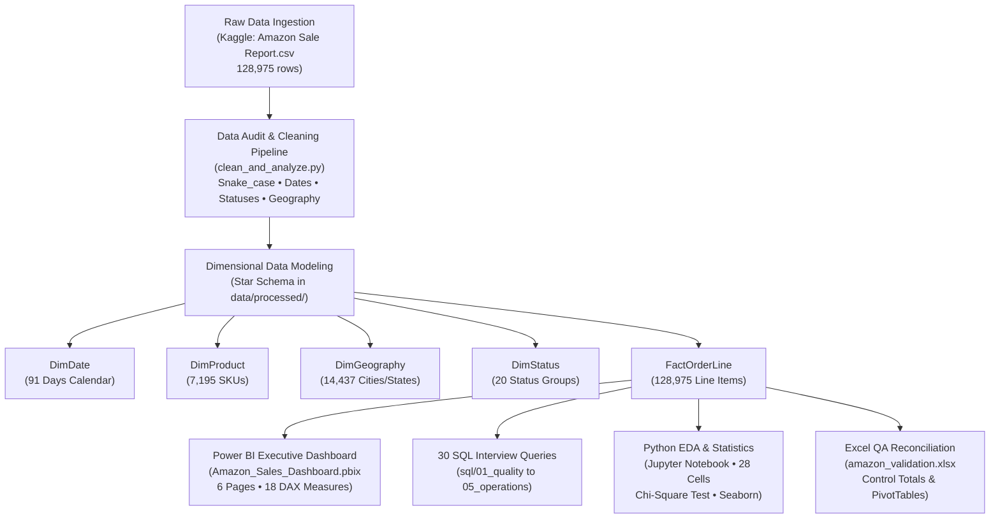

# Amazon India E-Commerce Sales, Product & Operations Analytics

[](https://www.python.org/)
[](https://powerbi.microsoft.com/)
[](https://www.postgresql.org/)
[](https://www.microsoft.com/excel)
[](https://www.kaggle.com/datasets/thedevastator/unlock-profits-with-e-commerce-sales-data)

> **An End-to-End Enterprise Data Analytics Case Study** analyzing **128,975 transactions** (~₹78.7M GMV) across Q2 2022 from Amazon India marketplace operations. Demonstrates rigorous data grain auditing, dimensional modeling (Star Schema), statistical hypothesis testing, an interactive 6-page Power BI dashboard, and 30 interview-grade SQL queries.

---

## 📌 Executive Summary & Key Results

| Business Indicator | Verified Value | Analytical Definition / Business Meaning |
| :--- | :--- | :--- |
| **Gross Merchandise Value (GMV)** | **₹78,681,022.35** | Total booked order revenue before operational leakage |
| **Net Realized Revenue** | **₹70,374,984.05** | Actual fulfilled cashflow collected (**89.4% realization rate**) |
| **Distinct Order Count** | **120,378** | Unique customer transactions (`DISTINCTCOUNT(order_id)`) |
| **Total Transaction Line Items** | **128,975** | Row-level catalog items purchased (**1.071 items/order**) |
| **Fulfilled Order Volume** | **101,201** (84.1%) | Successfully delivered / non-cancelled shipments |
| **Order Cancellation Rate** | **14.35%** (17,277 orders) | Primary operational leakage (~₹8.3M trapped gross GMV) |
| **Customer Return (RTS) Rate** | **1.65%** (1,985 orders) | Return-to-Seller rate across all courier channels |
| **Average Order Value (AOV)** | **₹695.40** | Average realized basket value per fulfilled order |
| **Catalog Concentration (Pareto)** | **18.5% SKUs $\rightarrow$ 80% Rev** | Top **1,332 SKUs** generate 80% of total revenue (**Class A**) |
| **Geographic Concentration** | **Top 3 States $\rightarrow$ 44.1% Rev** | Maharashtra, Karnataka, and Telangana drive national volume |
| **B2B Enterprise Contribution** | **₹558,924.38** (0.79% Rev) | Wholesale institutional sales with higher average basket size |

---

## 🏗️ Analytics Architecture & Star Schema Model



### The Data Grain Rule
* **1 Row = 1 Order Line Item**, NOT an individual order.
* Multiple rows frequently share the same `Order ID` due to multi-SKU basket purchases.
* **Order metrics must always use `DISTINCTCOUNT(order_id)`** to prevent artificial inflation of transaction volume.

---

## 📊 Power BI Dashboard Architecture (6 Pages)

The project includes an executive-grade Power BI workbook (**[`powerbi/Amazon_Sales_Dashboard.pbix`](powerbi/Amazon_Sales_Dashboard.pbix)**) built with an Amazon brand palette (`#146EB4`, `#FF9900`, `#0F172A`), white floating cards, and 8px rounded borders:

```
┌──────────────────────────────────────────────────────────────────────────────────────────┐
│  PAGE 1: Executive Overview       │  PAGE 2: Sales Performance & Run-Rate                │
│  - 5 KPI Scorecards with Deltas   │  - Daily Sales Run-Rate with 7-Day Moving Average    │
│  - Monthly Revenue & AOV Combo    │  - Day-of-Week Revenue Seasonality                   │
│  - Revenue Mix by Category Donut  │  - MoM Revenue Growth Bar Chart                      │
│  - Top 10 States & Top 10 SKUs    │  - Category Volume vs Revenue Scatter Bubble         │
├───────────────────────────────────┼──────────────────────────────────────────────────────┤
│  PAGE 3: Product Merchandising    │  PAGE 4: Geographic Intelligence                     │
│  - Pareto (80/20) Cumulative Curve│  - Full-Height India State Revenue Filled Map        │
│  - Product Performance Matrix     │  - Top 15 Metro Cities Bar Chart                     │
│  - Category x Size Heatmap Matrix │  - Category Preference Mix Across Top 5 States       │
│  - AI Revenue Decomposition Tree  │  - Regional Concentration Index                      │
├───────────────────────────────────┼──────────────────────────────────────────────────────┤
│  PAGE 5: Operations & Logistics   │  PAGE 6: B2B vs B2C & Sales Channel Intelligence     │
│  - Amazon FBA vs Merchant Volume  │  - B2B Wholesale vs Retail B2C Revenue Donut         │
│  - FBA vs Merchant Cancellation % │  - Channel Revenue Comparison                        │
│  - Order Status Funnel & Leakage  │  - B2B Product Category Demand Treemap               │
│  - Shipping Service Level Bars    │  - Top 10 States for B2B Purchasing                  │
└──────────────────────────────────────────────────────────────────────────────────────────┘
```

---

## 🗄️ SQL Analysis Suite (30 Interview Queries)

The **[`sql/`](sql/)** folder contains 30 interview-grade SQL queries organized into 5 operational modules:

1. **[`01_quality.sql`](sql/01_quality.sql)** (Queries 1–6): Data grain audit, multi-line order ratios, duplicate detection, and control total reconciliation.
2. **[`02_sales.sql`](sql/02_sales.sql)** (Queries 7–12): Daily sales run-rate, 7-day rolling moving averages (`AVG(...) OVER (ORDER BY date ROWS BETWEEN 6 PRECEDING AND CURRENT ROW)`), and MoM growth using `LAG()`.
3. **[`03_product.sql`](sql/03_product.sql)** (Queries 13–18): Category contribution, Pareto 80/20 ABC classification using cumulative window sums (`SUM(net_revenue) OVER (ORDER BY net_revenue DESC)`), and apparel size demand matrices.
4. **[`04_geography.sql`](sql/04_geography.sql)** (Queries 19–24): State revenue leaderboards, geographic market concentration, metro density, and state AOV variance vs national benchmark.
5. **[`05_operations.sql`](sql/05_operations.sql)** (Queries 25–30): Amazon FBA vs Merchant comparison, shipping service level performance, operational leakage funnel, RTS rates, and at-risk product flags ($>25\%$ cancellation rate).

---

## 💡 Top Business Insights & Recommendations

### 1. Fix the 14.35% Order Cancellation Leakage
* **Finding:** 17,277 orders were cancelled, trapping **₹8.3M in unrealized GMV**. Cancellations occur significantly more on Merchant self-ship orders than on Amazon FBA.
* **Action:** Shift high-volume Merchant listings to **Amazon FBA (Fulfilment by Amazon)** to reduce fulfillment latency, and introduce automated WhatsApp/SMS order verification for Cash-on-Delivery orders.

### 2. Protect Inventory on the "Hero Duo" (Set & Kurta)
* **Finding:** *Set* (₹39.2M / 40.5%) and *Kurta* (₹21.3M / 28.5%) drive **nearly 70% of total revenue**.
* **Action:** Establish automated safety stock alerts for the top 18.5% Pareto SKUs in these two categories to prevent stock-outs during peak shopping periods.

### 3. Rebalance Apparel Production Ratios
* **Finding:** Sizes **M, L, and XL** account for over 65% of fulfilled volume, while **XS, 5XL, and 6XL** represent long-tail demand with higher aging risk.
* **Action:** Standardize batch manufacturing ratios to 3:3:2 (M:L:XL) and reduce upfront runs for outlier sizes to prevent inventory markdowns.

### 4. Optimize Logistics for Western & Southern India
* **Finding:** **Maharashtra (21.4%), Karnataka (13.7%), and Telangana (9.0%)** account for over 44% of total sales.
* **Action:** Stage regional safety stock inside Mumbai, Bengaluru, and Hyderabad fulfillment centers to enable next-day Prime delivery and lower return rates.

---

## 📁 Repository Structure

```text
amazon-ecommerce-data-analyst/
├── data/
│   ├── raw/
│   │   └── Amazon Sale Report.csv                        # Untouched raw dataset (128,975 rows)
│   └── processed/
│       ├── FactOrderLine.csv                             # Star Schema Fact Table
│       ├── DimProduct.csv                                # Dimension: 7,195 SKUs
│       ├── DimGeography.csv                              # Dimension: 14,437 Cities/States
│       ├── DimStatus.csv                                 # Dimension: 20 Status buckets
│       ├── DimDate.csv                                   # Dimension: Continuous Calendar (91 Days)
│       └── cleaned_amazon_sales.csv                      # Master flat table for single-table import
├── notebooks/
│   └── amazon_ecommerce_analysis_and_visualization.ipynb # Pre-executed 28-cell EDA Notebook (864 KB)
├── powerbi/
│   ├── Amazon_Sales_Dashboard.pbix                       # Production Power BI Workbook (5.12 MB)
│   ├── dax_measures.dax                                  # Reference library of 18 DAX measures
│   └── dashboard_construction_guide.md                   # Visual blueprint and layout documentation
├── sql/
│   ├── 01_quality.sql                                    # Q1–Q6: Data grain & reconciliation
│   ├── 02_sales.sql                                      # Q7–Q12: Run rates, moving averages & MoM
│   ├── 03_product.sql                                    # Q13–Q18: Pareto 80/20 & size cross-tab
│   ├── 04_geography.sql                                  # Q19–Q24: State rankings & metro demand
│   └── 05_operations.sql                                 # Q25–Q30: FBA vs Merchant & cancellations
├── excel/
│   └── amazon_validation.xlsx                            # Multi-sheet QA & Control Reconciliation
├── clean_and_analyze.py                                  # Automated ETL pipeline script
├── data_quality_reconciliation_report.md                 # Verified control numbers documentation
├── requirements.txt                                      # Python dependencies
└── README.md                                             # Project portfolio documentation
```

---

## 🚀 How to Run Locally

### 1. Clone the Repository & Install Dependencies
```bash
git clone https://github.com/your-username/amazon-ecommerce-sales-analytics.git
cd amazon-ecommerce-sales-analytics
pip install -r requirements.txt
```

### 2. Run Data Cleaning & ETL Pipeline
```bash
python clean_and_analyze.py
```
*Generates all clean Star Schema tables in `data/processed/` and prints verified KPI control totals.*

### 3. Open the Jupyter EDA Notebook
```bash
jupyter notebook notebooks/amazon_ecommerce_analysis_and_visualization.ipynb
```

### 4. Open Power BI Dashboard
* Open **`powerbi/Amazon_Sales_Dashboard.pbix`** in **Power BI Desktop** to explore the 6 interactive pages.

---

## 💼 Resume Project Description

**Amazon India E-Commerce Sales & Operations Analytics** | *SQL, Python, Power BI, Excel*
* Engineered an end-to-end analytics solution on **128,975 e-commerce transactions** (~₹78.7M GMV) analyzing sales trends, product Pareto concentration, logistics, and B2B wholesale channels.
* Designed and deployed a **Star Schema data model** (`FactOrderLine`, `DimProduct`, `DimGeography`, `DimStatus`, `DimDate`) preventing multi-line grain distortion across 120,378 distinct orders.
* Authored **30 interview-grade SQL queries** using CTEs, window functions (`LAG`, `DENSE_RANK`, `SUM() OVER ()`), and cross-tab pivots for MoM growth, Pareto 80/20 classification, and operational funnels.
* Developed an interactive **6-page Power BI dashboard** with 18 DAX measures for Net Revenue, AOV, Cancellation Rates, moving averages, and merchandising decomposition trees.
* Identified that **18.5% of SKUs generate 80% of revenue** and surfaced a **14.35% cancellation rate** (~₹8.3M leakage), providing 5 evidence-backed management recommendations.
